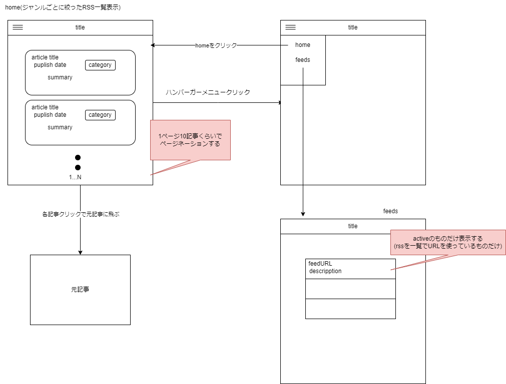

# My Rss Client

https://github.com/cacaoMath/rss_collect_api で作成したapiを使って、RSSを読むためのアプリ

## 開発

開発サーバ起動は以下:

```bash
npm run dev
```

パッケージのインストールは

```bash
npm ci
# or
npm i
```

[http://localhost:3000](http://localhost:3000) でページを確認することができる。

## 概要

https://github.com/cacaoMath/rss_collect_api で作成したapiを使って、RSSの記事を読む用のwebアプリ

### アプリの構成

コンポーネントはMUIを使用している

- https://mui.com/

フレームワークはNextでapp routerを使う

- https://nextjs.org/

APIとの通信とアプリでの処理はAxios + Tan Stack Queryを使う

- https://axios-http.com/
- https://tanstack.com/

使用言語はTypeScript
テストはJest

エラーなどは https://rss-api.cacaomath.com/docs で定義されたものを基本的にはひろう。
それ以外は、今のところrequest時のエラーと、それら以外の予想外のエラーで分けることとしている。 (今ある実装は api/RssApi.ts )

### 画面構成

現在の画面構成(予定も含む)は以下



### 今後の予定

- 記事一覧をジャンルごとに変えられるようにしたい
- Firebase(cognitoとかでも)で認証機能をもってもらい、認証が必要な機能を追加する(ユーザーやユーザーごとの記事保存とか、いろいろなデータ更新の伴う機能)
